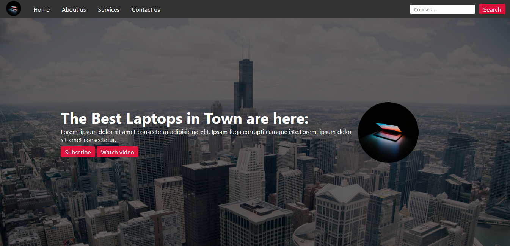

```markdown
# Ammar Laptop's Landing Page



Welcome to the Ammar Laptop's Landing Page repository! This project showcases a responsive landing page for an online laptop store. It is built using HTML, CSS, and JavaScript to provide an engaging user experience on various devices.

## Features

- **Responsive Design**: The landing page is designed to be fully responsive, adapting to different screen sizes and orientations.

- **Navigation Bar**: A responsive navigation bar allows users to easily navigate to different sections of the page, and a mobile-friendly menu icon is included.

- **Hero Section**: The hero section features an attention-grabbing headline, descriptive text, and call-to-action buttons.

- **Information Sections**: Multiple sections provide detailed information about the services and offerings of Ammar Laptop's.

- **Contact Form**: A contact form is included for users to reach out with their inquiries or concerns.

## Usage

1. Clone the repository to your local machine:

   ```sh
   git clone https://github.com/MuhammadAmmarAtique/LaptopSellingWeb
   ```

2. Open the `index.html` file in your web browser to explore the Ammar Laptop's Landing Page.

## Technologies Used

- HTML
- CSS
- JavaScript

## Contributors

This project was created by Muhammad Ammar Atique as a demonstration of web development skills. Contributions and improvements are welcome!

## License

This project is for educational purposes and is not associated with any real business. All resources used are subject to their respective licenses.

---


